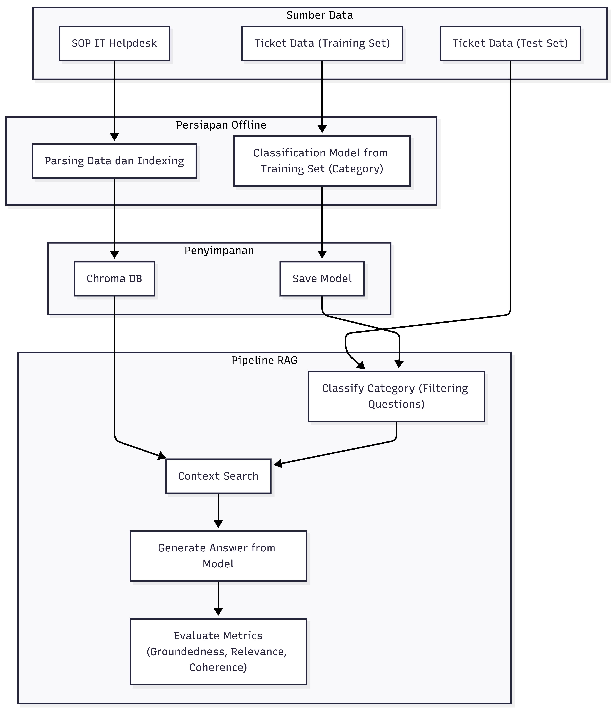

# IT Helpdesk RAG System

**Author:** Faraday Barr Fatahillah

A fully local **Retrieval-Augmented Generation (RAG)** system for an IT service
desk — it takes an incoming ticket, classifies its category, retrieves the
relevant SOP procedure, generates an answer with a local LLM, and then scores
its own output with an LLM-as-Judge evaluator. **No paid APIs and no cloud
services**: everything runs on your machine.

> **Note on language:** the documentation and notebook are in English, but the
> knowledge base (`SOP_IT_Helpdesk.md`) and the ticket datasets are in
> **Indonesian**, modelling a real Indonesian enterprise service desk. This is
> deliberate — the retrieval corpus and the queries share a language, which is
> what keeps retrieval accurate.

---

## Architecture

```
User query
     │
     ▼
[1] Category classification
    └─ TF-IDF + Logistic Regression
     │
     ▼
[2] Context retrieval
    └─ ChromaDB + SentenceTransformer (all-MiniLM-L6-v2)
     │
     ▼
[3] Answer generation
    └─ Ollama (llama3)
     │
     ▼
[4] Answer quality evaluation
    └─ LLM-as-Judge (Groundedness · Coherence · Relevance)
```



| Component                  | Technology                                  |
| -------------------------- | ------------------------------------------- |
| Ticket classification      | TF-IDF + Logistic Regression (scikit-learn) |
| Vector storage & retrieval | ChromaDB (persistent)                       |
| Text embeddings            | `all-MiniLM-L6-v2` (SentenceTransformers)   |
| Answer generation          | Ollama (`llama3`)                           |
| Quality evaluation         | LLM-as-Judge across 3 metrics               |

---

## Repository structure

```
it-helpdesk-rag/
├── it_helpdesk_rag.ipynb                    # Main notebook
├── SOP_IT_Helpdesk.md                       # SOP knowledge base (required)
├── tickets_IT_helpdesk_150each.csv          # Classifier training set
├── tickets_IT_helpdesk_testset_30each.csv   # Test set
├── results.jsonl                            # Batch RAG output (generated)
├── results_evaluated.jsonl                  # Evaluation output (generated)
├── pipeline_architecture.png                # Architecture diagram
├── classifier.pkl                           # Trained model (generated, gitignored)
├── chroma_db/                               # ChromaDB vector store (generated, gitignored)
├── requirements.txt                         # Python dependencies
└── README.md
```

---

## Prerequisites

**Python 3.10+**, and **Ollama** running locally with the `llama3` model:

```bash
# Install Ollama — see https://ollama.com for full instructions
ollama pull llama3
ollama serve
```

Then install the Python dependencies:

```bash
pip install -r requirements.txt
```

---

## Running it

1. Clone this repository.
2. Make sure `SOP_IT_Helpdesk.md` and both ticket CSVs are in the same directory
   as the notebook (they ship with the repo).
3. Confirm Ollama is running and `llama3` has been pulled.
4. Run the notebook cells in order, from Cell 0 to Cell 11:

```bash
jupyter notebook it_helpdesk_rag.ipynb
```

`classifier.pkl` and `chroma_db/` are not committed — they are regenerated by
Cells 1 and 2 on the first run.

---

## Notebook walkthrough

| Cell | Title                          | Description                                                      |
| ---- | ------------------------------ | ---------------------------------------------------------------- |
| 0    | Global configuration           | Model constants, file paths, and the valid category list          |
| 1    | Train the classifier           | Fits TF-IDF + Logistic Regression, saves `classifier.pkl`         |
| 2    | Parse SOP & index in ChromaDB  | Splits the SOP into chunks and indexes them                       |
| 3    | Reload the classifier          | Loads the model back from `classifier.pkl`                        |
| 4    | `classify_query()`             | Classifies a ticket into a category                               |
| 5    | `retrieve()`                   | Retrieves the relevant SOP passages from ChromaDB                 |
| 6    | `response_generate()`          | Generates an answer via Ollama, grounded in retrieved context     |
| 7    | Batch inference                | Runs the RAG pipeline across the whole test set                   |
| 8    | Evaluation functions           | Defines the LLM-as-Judge scorers for the 3 metrics                |
| 9    | Batch evaluation               | Scores every RAG result                                           |
| 10   | Summary statistics             | Mean, min, max, and std for each metric                           |
| 11   | Problem records                | Surfaces tickets that scored poorly                               |

---

## Evaluation metrics

The system grades its own answers with an **LLM-as-Judge**, on a **1–5** scale:

| Metric           | Definition                                                            |
| ---------------- | --------------------------------------------------------------------- |
| **Groundedness** | Is every claim in the answer supported by the retrieved SOP context?  |
| **Coherence**    | Is the answer logically structured, fluent, and easy to follow?       |
| **Relevance**    | Does the answer directly address the user's question?                 |

Any ticket scoring below **3** on any metric is flagged for further analysis.

---

## Supported ticket categories

The six categories are shared by the ticket datasets, the classifier, and the six
sections of `SOP_IT_Helpdesk.md`, so a predicted category maps directly onto the
SOP section that answers it.

| Category     | SOP section | Scope                                                   |
| ------------ | ----------- | ------------------------------------------------------- |
| **Access**   | SOP-001     | Authentication, MFA, password resets, access rights     |
| **Network**  | SOP-002     | Connectivity, VPN, WiFi, proxy configuration            |
| **Hardware** | SOP-003     | Physical device faults: printers, monitors, laptops     |
| **ERP**      | SOP-004     | SAP GUI errors, locked SAP accounts                     |
| **Software** | SOP-005     | Email, Office 365, application licensing                |
| **Other**    | SOP-006     | General services: room booking, ID card replacement     |

---

## Notes

- Cell 1 (training) only needs to run once; afterwards Cell 3 reloads the saved
  model.
- ChromaDB persists to `./chroma_db`. Cell 2 drops and rebuilds the collection
  every time it runs.
- `results.jsonl` and `results_evaluated.jsonl` in this repository were produced
  by an earlier revision of the pipeline. Re-run Cells 2 and 7 through 11 to
  regenerate them against the current code.
- Answer quality depends heavily on how completely `SOP_IT_Helpdesk.md` covers
  the procedure being asked about.
- Runtime for Cells 7 and 9 depends on how fast Ollama runs on your machine.
